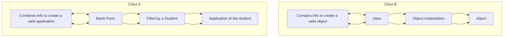

# OBJECT ORIENTED PROGRAMMING
Solving a problem by creating object is one of the most popular approaches in programming. This is called object-oriented programming.

  - This concept focuses on using reusable code (DRY Principle).

## **DRY Principle**
The DRY principle in Object-Oriented Programming (OOP), including in Python, stands for: *`Don't Repeat Yourself`*

### **Meaning:**
  - The DRY principle encourages writing code in such a way that no piece of logic is duplicated. If you find yourself copying and pasting the same code more than once, that’s a sign you should refactor.

### **Purpose:**
  - To reduce redundancy.

  - To improve maintainability.

  - To make code easier to debug and extend.

### **In OOP (Python), you apply DRY by:**
  1. Using classes and objects to encapsulate behavior.
  2. Creating reusable methods/functions.
  3. Using inheritance to avoid rewriting code in subclasses.
  4. Using composition to reuse code via object relationships.
  5. Modularizing code into separate files/modules.

### **Example (Bad – violating DRY):**
```python
print("Welcome, John")
print("Welcome, Mary")
print("Welcome, Alice")
```
### **Example (Good – following DRY):**
```python
def welcome(name):
    print(f"Welcome, {name}")

welcome("John")
welcome("Mary")
welcome("Alice")
```
### **OOP Example (Inheritance for DRY):**
```python
class Animal:
    def speak(self):
        print("Animal speaks")

class Dog(Animal):
    pass

class Cat(Animal):
    pass

dog = Dog()
cat = Cat()
dog.speak()  # Output: Animal speaks
cat.speak()  # Output: Animal speaks
```
> Here, `Dog` and `Cat` reuse the `speak` method from `Animal`, avoiding code repetition.

### **Summary:**
The DRY principle helps keep your code clean, reusable, and easy to manage — a core practice in writing good Python OOP code.

## **CLASS**
  - A class is a blueprint for creating object.




### **Syntax**:
```python
class Employee:     # Class name is written in pascal case
    # Methods & Variables
```
## **OBJECT**

An object is an instantiation of a class. When class is defined, a template (info) is defined. Memory is allocated only after object instantiation.

Objects of a given class can invoke the methods available to it without revealing the implementation detailed to the user. - Abstractions & Encapsulation!

## **MODELLING A PROBLEM IN OOPS**
We identify the following in our problem.
   - **Noun** → `Class` → `Employee`
   - **Adjective** → `Attributes` → `name, age, salary`
   - **Verbs** → `Methods` → `getSalary()`, `increment()`

  
## **CLASS ATTRIBUTES**
An attribute that belongs to the class rather than a particular object.
### **Example:**

```python
class Employee:
  company = "Google"  # Specific to Each Class
vandana = Employee()  # object Instatiation
vandana.company
Employee.company = "YouTube"   # changing class Attribute
```

### **INSTANCE ATTRIBUTES**
An attribute that belongs to the Instance(object). Assuming the class from the previous example:

```python
vandana.name = "vandana"
vandana.salary = "30k" # Adding instance attribute
```
> **Note:** Instance attributes, take preference over class attributes during assignment & retrieval.

- When looking up for vandana.attribute it checks for the following:
   1) Is attributes present in object?
   2) Is attributes present in class?


### **SELF PARAMETER**
Self refers to the instance of the class. It is automatically passed with a function call from an object.

```python
vandana.getSalary()    # here self is vandana 
# equivalent to Employee.getSalary(vandana)
```
The function getSalary() is defined as:

```python

class Employee:
  company = "Google"
  def getSalary(self):
    print("Salary is not there")
```

### **Static Method**

Sometimes we need a function that not use the self-parameter. We can define a static method like this:

```python
@staticmethod        # decorator to make as a static method
def greet():
  print("hello World!")
```

### **`__INIT__()` CONSTRUCTOR**
 - \_\_init\_\_() is a special method which is first run as soon as the object is created.
 - \_\_init\_\_() method is also known as constructor.
 - It takes self-argument and can also take further arguments.
***For Example:***

```python
class Employee:
  def __init__(self, name):
    self.name=name

  def getSalary(self):


harry = Employee("Harry")
```