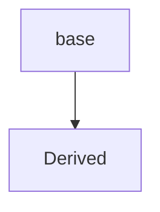
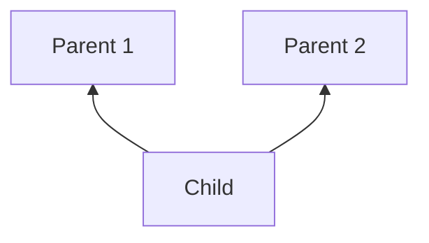
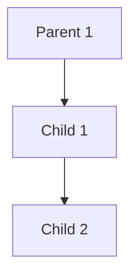

# INHERITANCE & MORE ON OOPS
Inheritance is a way of creating a new class from an existing class.

### **Syntax:**
```python
class Employee:     #  Base/ parent class
    # code
class Programmer(Employee): # Derived or child class
    # Code
```
- We can use the method and attributes of 'Employee' in 'Programmer' object.
- Also, we can overwrite or add new attributes and methods in 'Programmer' class.

## **TYPES OF INHERITANCE**
    - Single inheritance
    - Multiple inheritance
    - Multilevel inheritance

## **SINGLE INHERITANCE**
Single inheritance occurs when child class inherits only a single parent class.


<div style="text-align: center;">



</div>

## **MULTIPLE INHERITANCE**

Multiple inheritance occurs when the child class inherits from moer than one parent classes.




## **MULTILEVEL INHERITANCE**
When a child class becomes a parent for another child class.



## **SUPER() METHOD**
super() method is used to access the methods of a super class in the derived class.
```python
super().__init__()
# __init__() Calls constructor of the base class
```

## **CLASS METHOD**
  - A class method is a method which is bound to the class and not the object of the class.

  - `@classmethod` decorator is used to create a class method.

### ***Syntax:***
```python
@classmethod
    def(cls,pi,p2):
```
## **`@PROPERTY` DECORATORS**
Consider the following class:

```python
class Employee:
    @property
    def name(self):
        return self.ename
```
If e = Employee() is an object of class employee, we can print (e.name) to print the ename by internally calling name() function.

## @.GETTERS AND @.SETTERS
  - The method name with `@property` decorator is called getter method.
  - We can define a function + @name.setter decorator like below:

```python
@name.setter
def name (self, value):
    self.ename = value
```
## **OPERATOR OVERLEADING IN PYTHON**

  - Operators in Python can be overloaded using dunder method.

  - These methods are called when a given operator is used on the objects.

  - Operators in Python can be overloaded using the following methods:

```python
p1+p2   #  p1.__add(p2)
p1-p2   #  p1.__sub(p2)
p1*p2   #  p1.__mul(p2)
p1/p2   #  p1.__truediv(p2)
p1//p2   #  p1.__floordiv(p2)
```

Other dunder/ magic method in Python:

```python
__str__()     # used to set what gets displayed upon calling str(obj)
__len__()     # used to set what gets displayed upon calling. __len__() or len(obj)
```

## **🔹What is Decorator?**

Decorator ek aisa function hota hai jo kisi doosre function/method ke upar ek *`“wrapper”`* ki tarah kaam karta hai — jisse us function ka behavior modify ho jata hai bina uska asli code badle.
  - Python mein decorators likhne ka tareeka hota hai: @<decorator_name>

## **🔹Decorators:-**
| **Decorator** | **Used For** | **Kya karta hai?** |
| --- | --- | --- |
| `@classmethod` | Class method banane ke liye | Method ko class ke saath bind karta hai (cls use hota hai). |
| `@staticmethod` | Static utility method ke liye | Na class (cls), na object (self) se matlab — just a normal function. |
| `@property` | Property banane ke liye | Method ko attribute ki tarah use karne deta hai (e.g. obj.name instead of obj.name()). |

## **🔹 Example of All 3 decocorators:**
```python

class Student:
    school_name = "ABC School"

    def __init__(self, name):
        self.name = name

    @classmethod
    def get_school(cls):
        return cls.school_name

    @staticmethod
    def welcome_message():
        return "Welcome to our school!"

    @property
    def uppercase_name(self):
        return self.name.upper()
```
### ***Usage:***
```python
s = Student("Rahul")

print(Student.get_school())         # class method
print(Student.welcome_message())    # static method
print(s.uppercase_name)             # property (notice: no () used)
```

### ***🔚 Summary:***
| **Decorator** | **Type** | **Method Uses** | **Typical Use** |
| --- | --- | --- | --- |
| `@classmethod` | Built-in decorator | cls | Jab class-level logic chahiye|
| `@staticmethod` | Built-in decorator | None | Jab general utility function chahiye |
| `@property` | Built-in decorator |self | Jab method ko attribute ki tarah use karna ho |

## **Types Of Decorators:**
Python mein decorators mainly `2 types` ke hote hain — lekin use-case ke basis pe hum unhe aur categories mein divide kar sakte hain.

🔹 1. **`Built-in Decorators`**(jo Python khud provide karta hai):-
Ye wo decorators hain jo Python already provide karta hai aur hum direct use kar sakte hain.

| **Decorator** | **Purpose** | **Kya karta hai?** |
| --- | --- | --- |
| `@classmethod` | Class method | cls pass karta hai instead of self |
| `@staticmethod` | Static method | Method ko independent banata hai |
| `@property` |	Getter |Method ko attribute ki tarah access karne deta hai |
| @<property>.setter | Setter | Kisi `@property` attribute ka setter define karta hai |
| @<property>.deleter | Deleter | Kisi property ko delete karne ka method |

🔹 2. **`Custom Decorators`** (jo hum khud banate hain):-
Ye decorators hum khud define karte hain specific purpose ke liye — jaise logging, timing, validation, etc.

## **🔹Example: Logging decorator**
```python

def log_function(func):
    def wrapper(*args, **kwargs):
        print(f"Function {func.__name__} called")
        return func(*args, **kwargs)
    return wrapper

@log_function
def greet(name):
    print(f"Hello, {name}!")**

greet("Ravi")
```
### ***Output:***

```sql
Function greet called
Hello, Ravi!
```
🔹**Based on Functionality, Decorators ko in types mein divide kiya ja sakta hai:**

| **Type** | **Purpose**|
| --- | --- |
| Function Decorators | Kisi bhi normal function ke behavior ko modify karte hain |
| Class Decorators | Puri class ka behavior wrap karte hain (rare use) |
| Method Decorators| Class ke methods par apply hote hain |
| Nested Decorators | Multiple decorators ek sath use hote hain |
| Parameterized Decorators | Jisme decorator khud arguments accept karta hai |

### *✅ Example: Parameterized Decorator*
```python

def repeat(times):
    def decorator(func):
        def wrapper(*args, **kwargs):
            for _ in range(times):
                func(*args, **kwargs)
        return wrapper
    return decorator

@repeat(3)
def say_hi():
    print("Hi!")

say_hi()
```
### ***Output:***
```
Hi!
Hi!
Hi!
```

## **🔚 Summary**
| **Type** | **Examples** |
| --- | --- |
| Built-in | `@staticmethod`, `@classmethod`, `@property` |
| Custom | `@log`, `@timer`, `@authenticate` |
| Function decorators | Normal functions ke liye |
| Method decorators | Class ke methods ke liye |
| Class decorators | Puri class modify karne ke liye |
| Parameterized decorators | Arguments accept karne wale decorators |