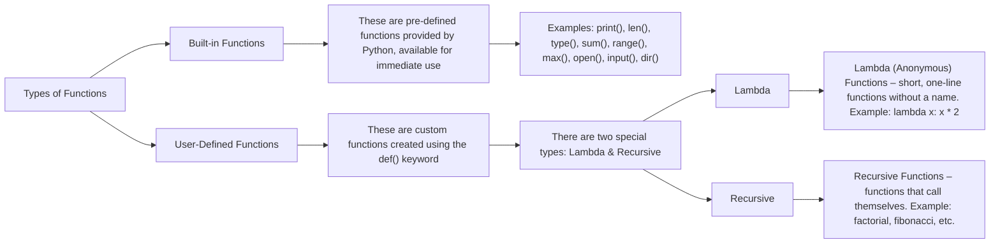

# FUNCTIONS & RECURSIONS


## Function
    - functions are `blocks of reusable code` that perform a specific task. They make programs `modular`, `readable`, and `efficient`.
    - A function is a group of statements performing a specific task..
    - When a program gets bigger in size and its complexity grows, it gets difficult for a program to keep track on which piece of code is doing what!
    - A function can be reused by the programmer in a given program any number of Example and syntax of a function.
    - The syntax of a function looks as follows:
        ```python
        def func1():
            print('hello')     # This function can be called any number of times, anywhere in the program.
        func1()
        ```
    <center><strong><em>OR</em></strong></center>

    - A function is like a small machine in your code.
    - You give it a name, write some steps inside it, and then you can use it anytime.
    - In short: A function is a saved set of instructions that you can use again and again.

## FUNCTION CALL
    - Whenever we want to call a function, we put the name of the function followed by parentheses as follows: `Func()`
    - A function call is when you tell the function to run the instructions that you saved.
        ```python
        def greet():
        print("Hello Vandana")

        greet()
        
        def func1():
            print('hello')     # This function can be called any number of times, anywhere in the program.
        func1()
        ```
## FUNCTION DEFINITION
- The part containing the exact set of instructions which are executed during the function call.


## TYPES OF FUNCTIONS IN PYTHON
- There are two types of functions in python:


# Quick Quiz: Write a program to greet a user with "Good day" using functions.
